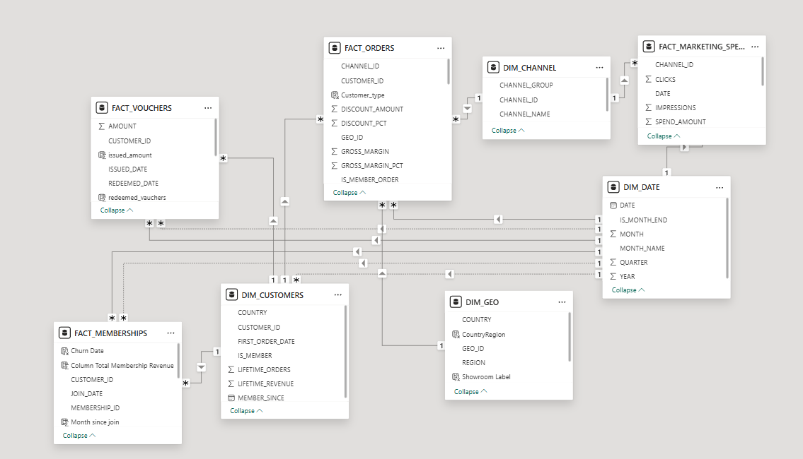
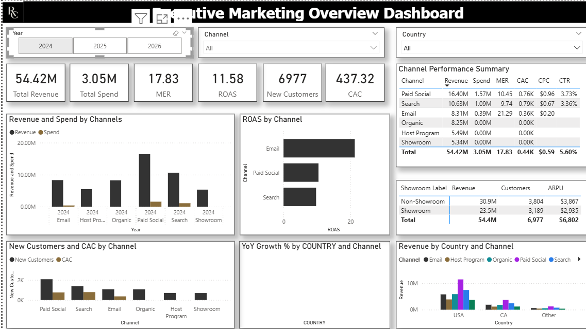
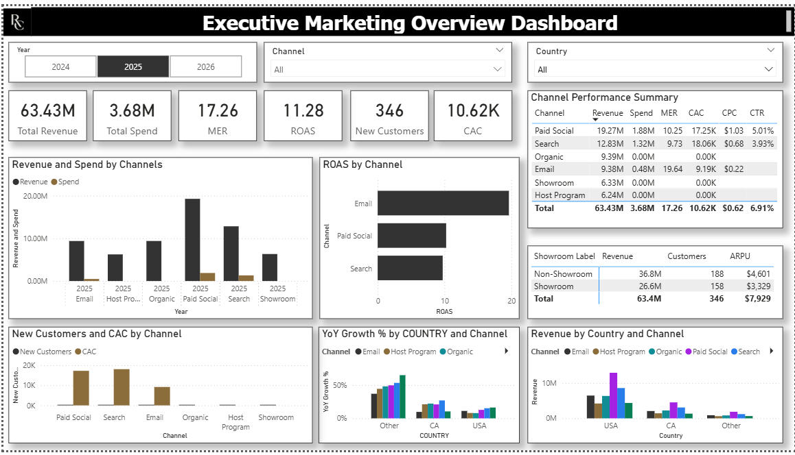

# Rove Concepts - Executive Marketing Overview Dashboard

This Power BI dashboard delivers a real-time executive view of Rove Concepts' marketing 
performance - tracking revenue, spend efficiency, customer acquisition costs, and geographic 
growth across all channels. 

The dashboard connects directly to a Snowflake data warehouse via a star schema model and 
covers a rolling 2-year period, enabling both year-over-year trend analysis and current 
performance monitoring.

## Table of Content

- [Problem Statement](#problem-statement)
- [Data Source](#data-source)
- [Tools & Tech Stack](#tools--tech-stack)
- [Dashboard Overview](#dashboard-overview)
- [DAX Code — Key Measures](#dax-code--key-measures)
- [Insights](#insights)
- [Recommendations](#recommendations)
## Problem Statement

Rove Concepts is a premium furniture brand operating across the USA, Canada, and emerging 
international markets, running an annual Membership program alongside a multi-channel 
marketing strategy.

With spend distributed across channels (Paid Social, Search, Email, Organic, Host 
Program, and Showroom) and revenue data sitting in Snowflake, there was no fast way to 
answer the questions that mattered most.

The dashboard designed to give executives and marketing managers immediate answers to:

- Which channels are driving the most revenue — and at what efficiency (MER / ROAS)?
- Where are we growing or shrinking year over year, by geography and channel?
- What does it cost to acquire a new customer, overall and by channel?
- Are showroom cities outperforming non-showroom cities on revenue and customer metrics?

The dashboard enables filter by date range, channel, and geography and have every metric update in real time, 
so budget and investment decisions are always grounded in current data.
## Data Source

All data is sourced from a **Snowflake data warehouse** using Import mode in Power BI.
The dataset covers a rolling 2-year period and contains ~66,000+ rows across all tables.

### Tables Used in Dashboard

| Table | Type | Key Fields | Role |
|---|---|---|---|
| `fact_orders` | Fact | `customer_id`, `channel_id`, `geo_id`, `order_date`, `revenue_gross`, `revenue_net` | Core revenue source |
| `fact_marketing_spend` | Fact | `channel_id`, `date`, `spend_amount`, `clicks`, `impressions` | Channel spend & efficiency |
| `dim_customers` | Dimension | `customer_id`, `first_order_date`, `is_member` | New customer identification |
| `dim_channel` | Dimension | `channel_id`, `channel_name`, `channel_group` | Channel grouping & labeling |
| `dim_geo` | Dimension | `geo_id`, `country`, `region`, `showroom_city`, `showroom_exists` | Geographic segmentation |
| `dim_date` | Dimension | `date`, `month`, `quarter`, `year` | Time intelligence (inactive join) |

### Star Schema

### Tools

| Tool | Purpose |
|---|---|
| **Power BI Desktop** | Dashboard development, data modeling, and interactive visualizations |
| **Snowflake** | Cloud data warehouse — single source of truth for all transactional and spend data |
| **DAX** | Calculated measures and KPIs (MER, ROAS, CAC, YoY Growth, New Customers) |
| **SQL** | Data extraction and transformation from Snowflake prior to Power BI import |
| **Power Query** | Data cleaning and shaping within Power BI |

## Dashboard Overview  
### Dashboard in Action

*Filters update all visuals in real time — switch between years, channels, 
and geographies to instantly compare performance.*

**2024 — Base Year**  

**2025 - Next Year**  

### Layout & Visuals Explained

The dashboard is structured as a single-page layout with 3 filter slicers at the top 
(Year, Channel, Country) and 8 visual sections below.

| Section | Visual Type | What It Shows |
|---|---|---|
| KPI Cards | Cards | Total Revenue, Total Spend, MER, ROAS, New Customers, CAC |
| Revenue and Spend by Channels | Clustered Column Chart | Revenue vs. Spend side-by-side per channel |
| ROAS by Channel | Stackted Bar Chart | Return on ad spend ranked by channel — Email consistently leads |
| Channel Performance Summary | Table | Revenue, Spend, MER, CAC, CPC, CTR per channel in one view |
| New Customers and CAC by Channel |Clustered Column Chart| Acquisition volume vs. cost — identifies most efficient channels|
| YoY Growth % by Country and Channel |Clustered Column Chart| Which markets and channels are growing or shrinking year over year|
| Revenue by Country and Channel | Clustered Bar Chart | Absolute revenue breakdown: USA vs. CA vs. Other, by channel |
| Showroom vs. Non-Showroom |Matrix | Revenue, Customers, and ARPU split by showroom presence |
